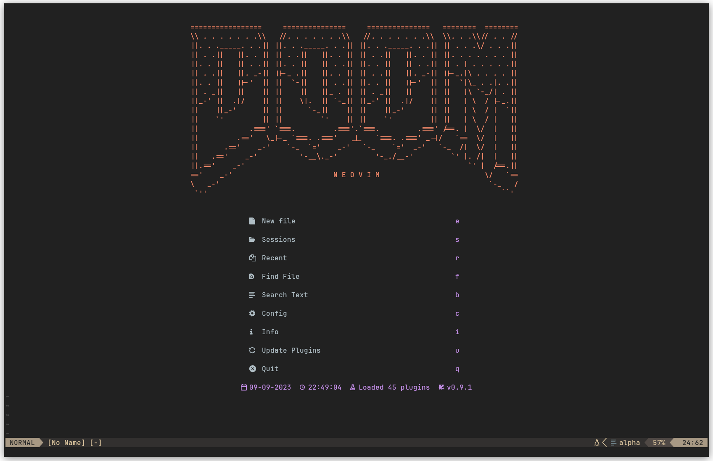
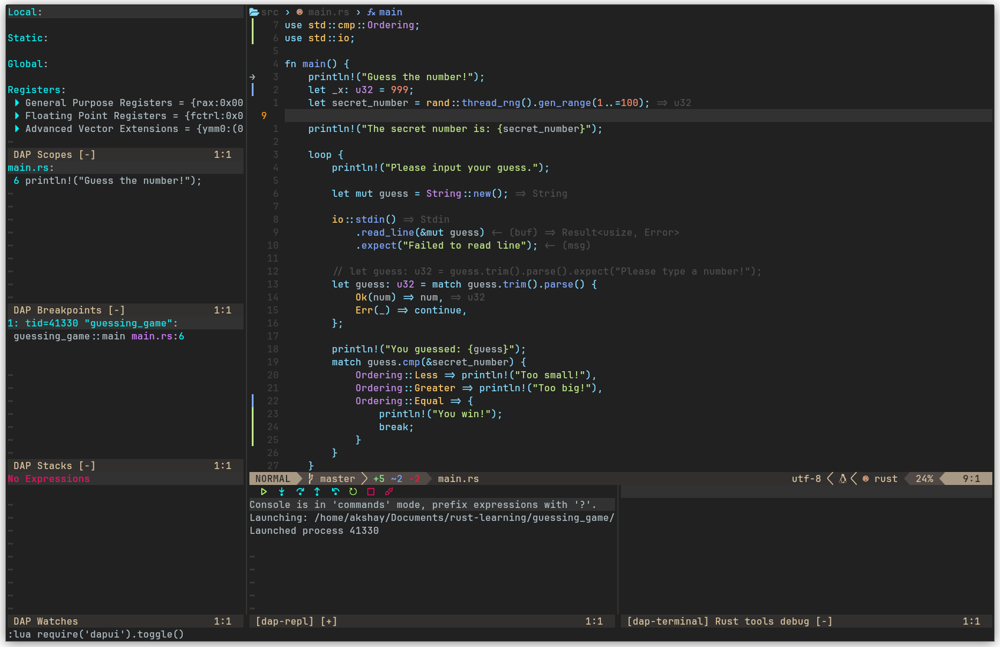

# Neovim Config

## Images





## Pre-requisites

You need to install certain packages to make sure that the config works
completely.

- **Install a Nerd Font:**

https://www.nerdfonts.com/

> [!NOTE]
> Recommended to use a true colour supported terminal such as kitty, alacritty etc

- **Python LSP Server**

Install python-lsp-server:

```bash
sudo apt install python3-pylsp
```

- **`nodejs` and `npm`**

Required to install certain LSPs from `mason.nvim`

Outdated version from Ubuntu 22.04 apt:

```bash
sudo apt install nodejs && npm
```

If you want an updated version, follow this: [NodeSource Node.js Binary Distributions](https://github.com/nodesource/distributions)

- **`ccls` (C/C++ LSP)**

I chose to use `ccls` over `clangd` for my C/C++ LSP as it works with PlatformIO.

```bash
sudo apt install ccls
```

- **Verilator**

```bash
sudo apt install verilator
```

- **Texlab**

I am using Texlab along with VimTex (installed via packer) for LaTeX LSP
Installation instructions: [texlab github](https://github.com/latex-lsp/texlab)

- **Zathura (PDF Viewer)**

**Optional**
VimTex can be configured to use any other PDF viewer such as Okular

```bash
sudo apt install zathura
```

- **LazyGit**

Used for git integration with NeoVim
Installation Instructions here: [lazygit github](https://github.com/jesseduffield/lazygit)

Make sure to configure it following this: https://github.com/jesseduffield/lazygit/blob/master/docs/Config.md

- **Dependancies for image.nvim**

This is a awesome plugin to enable image support for Neovim to use with
Markdown and Neorg.

In order for this plugin to work, install:

```bash
sudo apt install imagemagick
sudo apt install luarocks
sudo apt install curl
```

> Note: `curl` should be install out of the box
> And use `luarocks` to install `magick`

```bash
luarocks install magick
```

More details can be found in the github page for the plugin: [image.nvim github](https://github.com/3rd/image.nvim)

- **Rust Language Auto-Formatting**

You will need to install `rustfmt` to do any code autoformatting with Rust.
This should be installed along with Rust by default. Just incase it is not:

```bash
rustup component add rustfmt
```

- **X11 Clipboard**

Just incase xclip isn't installed (wasn't for me):

```bash
sudo apt install xclip
```

I didn't have any clipboard issues on Wayland.

- `ripgrep` and `fzf`

Needed for `Telescope.nvim`

```bash
sudo apt install  ripgrep
sudo apt install fzf
```

> [!IMPORTANT]  
> For the debugger configuration, nvim-dap, check the files in `lua/akshay/plugins/dap.lua`
> and in `lua/akshay/plugins/lsp/rust-tools.lua` to make sure you have the right path
> for lldb. I used the one from `mason.nvim`, If this is used, double check the username
> in the path.

- python-neovim
  You need to install pynvim or python-neovim using pip or your system package manager

- install sympy

## Installation

Installation is very simple, copy the repo contents to `~/.config/nvim/`

## Structure

All installed plugins can be found in [plugins-setup.lua](./lua/akshay/plugins-setup.lua)

- [init.lua](./init.lua) - load all plugins and lua files
- [Cheat-Sheet.md](./Cheat-Sheet.md) - A seperate markdown for list of keybinds
- [lua/](./lua/)
  - [akshay/](./lua/akshay/)
    - [plugins-setup.lua](./lua/akshay/plugins-setup.lua) - `mason.nvim` configuration and all installed plugins
    - [core/](./lua/akshay/core/)
      - [colorscheme.lua](./lua/akshay/core/colorscheme.lua) - Neovim Theme
      - [keymaps.lua](./lua/akshay/core/keymaps.lua) - Most keymaps defined here
      - [options.lua](./lua/akshay/core/options.lua) - General options such as set relative numbering, clipboard etc
    - [plugins/](./lua/akshay/plugins/)
      - [alpha.lua](./lua/akshay/plugins/alpha.lua) - `alpha.nvim` configuration (Neovim landing page)
      - [autopairs.lua](./lua/akshay/plugins/autopairs.lua) - `nvim-autopairs` configuration
      - [comment.lua](./lua/akshay/plugins/comment.lua) - `Comment.nvim` configuration
      - [dap.lua](./lua/akshay/plugins/dap.lua) - `nvim-dap` and `nvim-dap-ui` configuration
      - [discord.lua](./lua/akshay/plugins/discord.lua) - `presence.nvim` configuration
      - [gitsigns.lua](./lua/akshay/plugins/gitsigns.lua) - `gitsigns.nvim` configuration
      - [image.lua](./lua/akshay/plugins/image.lua) - `image.nvim` configuration
      - [lazygit.lua](./lua/akshay/plugins/lazygit.lua) - `lazygit.nvim` configuration
      - [lualine.lua](./lua/akshay/plugins/lualine.lua) - `lualine.nvim` configuration
      - [nvim-cmp.lua](./lua/akshay/plugins/nvim-cmp.lua) - `nvim-cmp` configuration
      - [nvim-tree](./lua/akshay/plugins/nvim-tree.lua) - `nvim-tree` configuration
      - [sessions.lua](./lua/akshay/plugins/sessions.lua) - `neovim-session-manager` configuration
      - [telescope.lua](./lua/akshay/plugins/telescope.lua) - `Telescope.nvim` configuration
      - [treesitter.lua](./lua/akshay/plugins/treesitter.lua) - `nvim-treesitter` configuration
      - [vimtex.lua](./lua/akshay/plugins/vimtex.lua) - VimTex configuration
      - **_Insert any future plugin additions_**
        - [lsp/](./lua/akshay/plugins/lsp/)
          - [ccls.lua](./lua/akshay/plugins/lsp/ccls.lua) - CCLS lsp configuration (C/C++ LSP)
          - [lspconfig.lua](./lua/akshay/plugins/lsp/lspconfig.lua) - Configuration for `nvim-lsp-config` and `cmp-nvim-lsp`, enable/disable LSPs and LSP keyboard shortcuts
          - [lspsaga.lua](./lua/akshay/plugins/lsp/lspsaga.lua) - `lspsaga.nvim` configuration
          - [mason.lua](./lua/akshay/plugins/lsp/mason.lua) - Configuration for `mason.nvim`, `mason-lsp-config.nvim`, `mason-null-ls.nvim` and `mason-nvim-dap`. Configuration for which LSPs, DAPs (debuggers), linters, and formatters to install automatically via `mason`
          - [mull-ls.lua](./lua/akshay/plugins/lsp/null-ls.lua) - Configuration for `null-ls.nvim` which allows to configure and enable formatters and linters installed from `mason`
          - [rustfmt.lua](./lua/akshay/plugins/lsp/rustfmt.lua) - Enable rust autoformatting provided by `rust.vim`
          - [rust-tools.lua](./lua/akshay/plugins/lsp/rust-tools.lua) - Configure LSP and Debugger path using `rust-tools.nvim`
          - **_Insert any future LSP additions_**

## Extending

Extending this config should be very simple:

- To install a plugin, add it in [plugins-setup.lua](./lua/akshay/plugins-setup.lua)
- To configure an added plugin, make a file in [lua/akshay/plugins/](./lua/akshay/plugins/) and create a file for that plugin (with a relevant file name), and add configurations there for that specific plugin
  - Don't forget to edit [init.lua](./init.lua) to load the new plugin
- To modify/add keybinds, edit [lua/akshay/core/keymaps.lua](./lua/akshay/core/keymaps.lua)
- To install additional LSPs, use `mason.nvim` (run `:MasonInstall`) and if you want them automatically installed, edit [mason.lua](./lua/akshay/plugins/lsp/mason.lua)
  - To configure an LSP, create a file in [lua/akshay/plugins/lsp/](./lua/akshay/plugins/lsp/) with a relevant file name and add configurations there
    - Load it by editing [init.lua](./init.lua)

## Keybinds

Custom keybinds on top of normal Neovim

| **Shortcut**                     | **Mode** | **Function**                                                                            |
| -------------------------------- | -------- | --------------------------------------------------------------------------------------- |
| `jk`                             | Insert   | Exit insert mode                                                                        |
| `<leader>nh`                     | Normal   | Clear search highlights                                                                 |
| `<leader>+`                      | Normal   | Increment a number                                                                      |
| `<leader>-`                      | Normal   | Decrement a number                                                                      |
| `<leader>sv`                     | Normal   | Split window vertically                                                                 |
| `<leader>sh`                     | Normal   | Split window Horizontally                                                               |
| `<leader>se`                     | Normal   | Make split window equal width and height                                                |
| `<leader>sx`                     | Normal   | Close current split window                                                              |
| `<leader>to`                     | Normal   | Open new tab                                                                            |
| `<leader>tx`                     | Normal   | Close current tab                                                                       |
| `<leader>tn`                     | Normal   | Go to next tab                                                                          |
| `<leader>tp`                     | Normal   | Go to previous tab                                                                      |
| `<leader>sm`                     | Normal   | Toggle split window maximisation                                                        |
| `<leader>e`                      | Normal   | Toggle Nvim Tree file explorer                                                          |
| `<leader>ff`                     | Notmal   | Find files within current working directory                                             |
| `<leader>fs`                     | Normal   | Find string in current working directory                                                |
| `<leader>fc`                     | Normal   | Find string under cursor in current working directory                                   |
| `<leader>fb`                     | Normal   | List open buffers in current Neovim instance                                            |
| `<leader>fh`                     | Normal   | List available help tags                                                                |
| `<leader>gg`                     | Normal   | Open Lazy Git                                                                           |
| `<leader>gc`                     | Normal   | List all git commits (use `cr` to checkout) [`gc` for git commits]                      |
| `<leader>gfc`                    | Normal   | List git commits for current file/buffer (use to checkout) [`gfc` for git file commits] |
| `<leader>gb`                     | Normal   | List git branches (use to checkout) [`gb` for git branch]                               |
| `<leader>gs`                     | Normal   | List current changes per file with diff preview [`gs` for git status]                   |
| `<leader>rs`                     | Normal   | Restart LSP server                                                                      |
| `<leader>co`                     | Normal   | Open terminal                                                                           |
| `F4`                             | Normal   | Toggle DAP UI                                                                           |
| `F5`                             | Normal   | Toggle DAP breakpoint                                                                   |
| `F9`                             | Normal   | DAP continue                                                                            |
| `F1`                             | Normal   | DAP step over                                                                           |
| `F2`                             | Normal   | DAP step into                                                                           |
| `F3`                             | Normal   | DAP step out                                                                            |
| `<leader>di`                     | Normal   | Toggle DAP UI                                                                           |
| `<leader>duh`                    | Normal   | DAP floating window to evaluate a variable                                              |
| `<leader>duf`                    | Normal   | DAP Floating window to see variables status                                             |
| `gcc`                            | Normal   | Toggle comment on one line                                                              |
| `gc<n>j`                         | Normal   | Toggle comment `<n>` lines down                                                         |
| `gc<n>k`                         | Normal   | Toggle Comment `<n>` lines up                                                           |
| `C-h`                            | Normal   | Move to buffer/tab/window left                                                          |
| `C-l`                            | Normal   | Move to buffer/tab/window right                                                         |
| `C-n`                            | Normal   | Start Multi-line edit, and press again to find more of the same patterns                |
| `C-<up/down arrow>` (multi-line) | Normal   | Create cursors vertically                                                               |
| `shift-<arrows>` (multi-line)    | Normal   | Select one character at a time                                                          |
| `n`/`N` (multi-line)             | Normal   | Get next/previous occurrence                                                            |
| `[/]` (multi-line)               | Normal   | select next/previous cursor                                                             |
| `q` (multi-line)                 | Normal   | Skip current and get next occurrence                                                    |
| `Q` (multi-line)                 | Normal   | Remove current cursor/selection                                                         |
| `i, a, I, A` (multi-line)        | Normal   | Start insert mode                                                                       |
| `gf`                             | Normal   | Show definition, references                                                             |
| `gD`                             | Normal   | Go to declaration                                                                       |
| `gd`                             | Normal   | See definition and make edits in a window                                               |
| `gi`                             | Normal   | Go to implementation                                                                    |
| `<leader>ca`                     | Normal   | See available code actions                                                              |
| `<leader>rn`                     | Normal   | Smart rename                                                                            |
| `<leader>D`                      | Normal   | Show diagnostics for line                                                               |
| `<leader>d`                      | Normal   | Show diagnostics for cursor                                                             |
| `[d`                             | Normal   | Jump to previous diagnostic in buffer                                                   |
| `]d`                             | Normal   | Jump to next diagnostic in buffer                                                       |
| `K`                              | Normal   | Show documentation for what is under the cursor                                         |
| `<leader>o`                      | Normal   | See outline on right hand side                                                          |
| `C-i`                            | Normal   | Jump forward                                                                            |
| `C-o`                            | Normal   | Jump backward                                                                           |

## TODO

- Improve README Page
- Neorg
- Copilot
- Setup Script
- which-key.nvim
- Plugins List
- Features and what works
- Make instruction distro-agnostic
